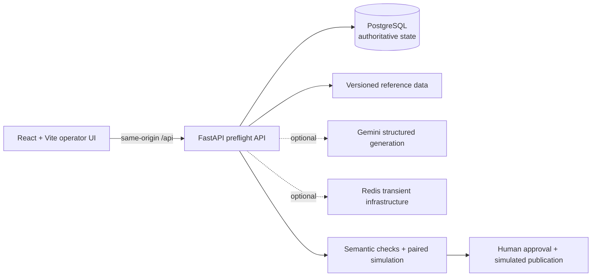

# CrowdCue 2.0

[](https://github.com/himanshu051116/croudqueue/actions/workflows/ci.yml)
[](https://croudcue.vercel.app)
[](https://www.python.org/)
[](https://react.dev/)

## CrowdCue 26 · Guidance Preflight

> **A message can be right for one fan. And wrong for the crowd.**

CrowdCue is a full-stack stadium-guidance preflight prototype. It treats generated multilingual guidance as untrusted: every message is compiled from a structured source, reverse-checked for semantic drift, stress-tested against a paired crowd-flow simulation, and held for explicit human approval before simulated publication.

**[Open the live deployment](https://croudcue.vercel.app)**

The demonstration uses a synthetic Aurora Stadium incident: Gate C is converging, a transit arrival is delayed, and Lift D2 is unavailable. The operator must choose and validate a targeted Gate A diversion without dropping protections for mobility-limited fans.

## What the Golden Flow proves

1. Loads versioned Aurora Stadium topology and the Gate C convergence scenario.
2. Persists an operational session and run in PostgreSQL.
3. Generates configuration-driven interventions and rejects unsafe candidates with evidence.
4. Selects the targeted Gate A diversion and creates the authoritative Guidance Intermediate Representation (GIR).
5. Produces EN/ES/FR variants for Fan App and PA channels.
6. Records whether copy came from live Gemini or the deterministic fallback.
7. In a protected demo mode, deliberately omits the Spanish Fan App mobility clause.
8. Reverse-compiles the rendered copy and blocks it with `PROTECTED_COHORT_OMITTED`.
9. Repairs only that variant as immutable version 2 while preserving the other five hashes.
10. Runs 200 paired samples under identical random conditions.
11. Recomputes the approval bundle on the server under a database row lock.
12. Simulates publication to Fan App, PA, Signage, and Volunteer Device surfaces.
13. Persists a hash-chained audit timeline and restores the run after refresh.

## Architecture



- **Frontend:** React 18, TypeScript, Vite, Tailwind CSS, TanStack Query, Playwright, and axe-core.
- **Backend:** Python 3.12, FastAPI, Pydantic, SQLAlchemy 2, Alembic, and psycopg 3.
- **State:** PostgreSQL is authoritative. Redis remains optional for the synchronous demo path.
- **AI:** Gemini runs only on the backend. If no valid key is configured, a deterministic fallback keeps the flow usable and is labelled honestly in provenance.
- **Deployment:** one Vercel project with separate Vite and FastAPI services, same-origin `/api` routing, and a repository-root backend build context.

## Safety model

CrowdCue intentionally separates generation from authority:

- The GIR, not rendered model text, is the source of truth.
- Accessibility and protected-cohort failures are blocking vetoes.
- Variant repairs create new immutable versions.
- Approval is recomputed server-side; a client-supplied hash is never authoritative.
- Stale approval bundles and invalid lifecycle transitions are rejected.
- Demo fault injection is disabled by default and forbidden in production configuration.
- Publication, venue state, and simulation results are visibly synthetic.

## Repository map

```text
backend/                 FastAPI domain, persistence, services, migrations, tests
frontend/                React operator experience and browser tests
reference_data/          Versioned venue, route, scenario, and terminology JSON
scripts/                 Seed, secret-scan, server, and verification utilities
reports/                 Historical verification evidence (rerun before release)
.github/workflows/       PostgreSQL/Redis CI and browser Golden Flow
requirements-runtime.txt Runtime-only Python dependency set
```

## Run locally

### Docker Compose

Prerequisites: Docker with Compose and an optional `GEMINI_API_KEY` for live generation.

```bash
cp .env.example .env
# Replace SECRET_KEY and the local database password before starting.
docker compose up --build
```

Open the UI at `http://localhost:5173`, the API at `http://localhost:8001`, and OpenAPI at `http://localhost:8001/docs`.

### Manual development

```bash
python -m venv .venv
# Windows: .venv\Scripts\activate
# Linux/macOS: source .venv/bin/activate
pip install -r requirements-dev.txt

# Start PostgreSQL first and provide DATABASE_URL.
alembic -c backend/alembic.ini upgrade head
python -m scripts.seed_database
python -m uvicorn backend.app.main:app --host 127.0.0.1 --port 8001
```

In another terminal:

```bash
cd frontend
npm ci
npm run dev
```

Vite proxies relative `/api` requests to the local backend.

## Verification

Run the repository's complete platform-appropriate verification script:

```bash
# Linux/macOS
./scripts/verify.sh

# Windows PowerShell
./scripts/verify.ps1
```

The checks include secret scanning, Black, isort, Flake8, strict mypy, branch-covered pytest, frontend lint/typecheck/build/audit, and Playwright/axe when a browser is available. With the API running, execute the full HTTP workflow with:

```bash
python scripts/verify_golden_flow.py \
  --base-url http://127.0.0.1:8001 \
  --output reports/golden-flow-http.json
```

See [TESTING.md](TESTING.md), [ARCHITECTURE.md](ARCHITECTURE.md), and [RELEASE_VERIFICATION.md](RELEASE_VERIFICATION.md) for the verification contract and current evidence.

## Vercel deployment

The Vite service uses `frontend/` as its root. FastAPI intentionally builds from the repository root so `backend.app` imports, `requirements-runtime.txt`, and `reference_data/` are bundled together. Database migrations and reference-data seeding are explicit release steps; they do not run during import, build, cold start, or each request.

Required environment-variable names (never commit their values):

```text
DATABASE_URL
SECRET_KEY
ENVIRONMENT=production
ENABLE_DEMO_FAULT_INJECTION=false
REDIS_REQUIRED=false
```

`GEMINI_API_KEY` and `REDIS_URL` are optional unless those integrations are intentionally enabled. See [VERCEL_DEPLOYMENT.md](VERCEL_DEPLOYMENT.md) for the release procedure.

## Honest scope

This repository is a safety-oriented product prototype, not a deployed stadium control system. It has no FIFA or live venue integration, the simulator is not a certified pedestrian model, and all publication actions are simulated. A deterministic fallback result must not be interpreted as a successful live-model call.

Download the clean tracked-source archive for [CrowdCue 2.0 (ZIP)](https://github.com/himanshu051116/croudqueue/archive/refs/tags/v2.0.0.zip).

## Security

Do not commit `.env` files, credentials, virtual environments, dependencies, browser reports, runtime logs, or local databases. Run `python scripts/secret-scan.py` before every release and follow [SECURITY.md](SECURITY.md) when reporting a vulnerability.
